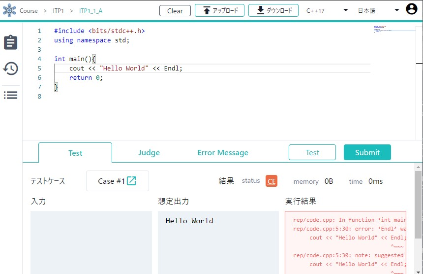
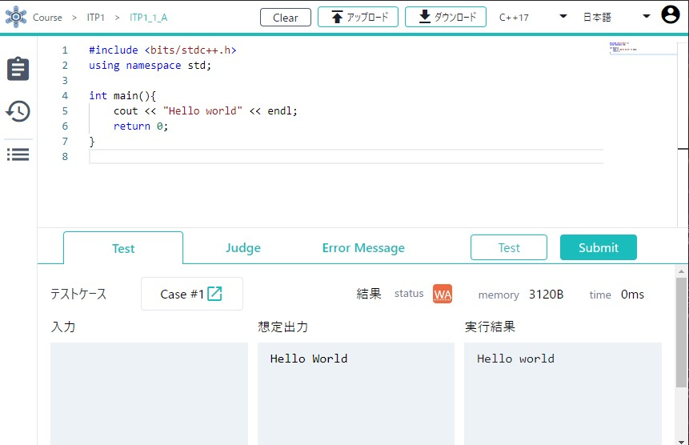
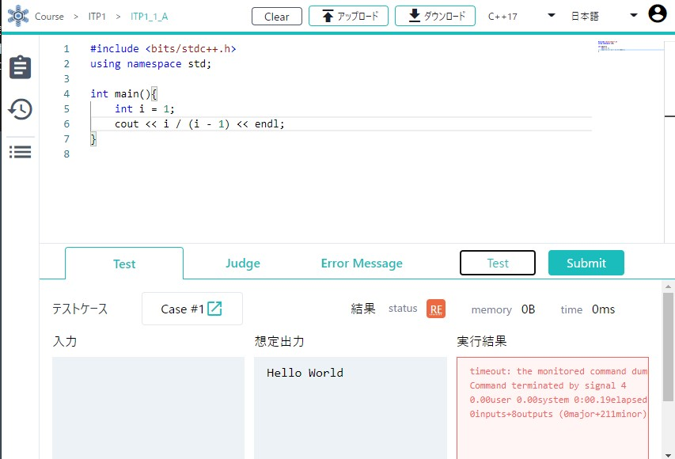
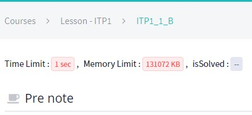
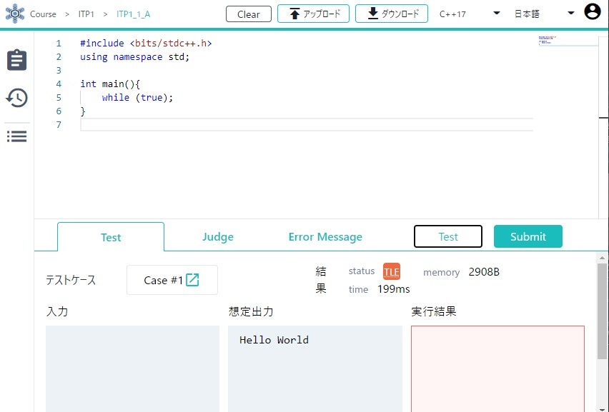
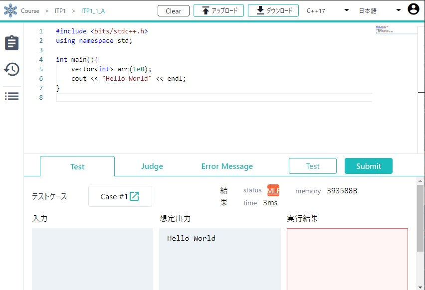

# 付録

初心者が競技プログラミングをするにあたって、知っておくと良い資料集です。現在、以下のコンテンツがあります。

- [サイト集](/beginner/appendix?id=サイト集): 初心者の競技プログラミングの学習において役立つサイト集です。実際の演習で紹介した Web サイトも再度紹介しています。
- [書籍集](/beginner/appendix?id=書籍集): 初心者の競技プログラミングの学習において役立つ書籍集です。
- [ジャッジのステータス集](/beginner/appendix?id=ジャッジのステータス集): 提出をした際に発生する、`WA` や `RE` 等のステータス（結果）集です。実際に発生してしまった時に見ると良いでしょう。

## サイト集
### ツール

実際の演習で使用されたツールを再度紹介します。リンクを忘れてしまった場合にご活用ください。

- [ITP1](https://onlinejudge.u-aizu.ac.jp/courses/lesson/2/ITP1/1): AOJ のプログラミング学習用問題集です。活用方法は[問題を見てみる](/beginner/getting-started?id=問題を見てみる)にて紹介しています。
- [ICE](https://onlinejudge.u-aizu.ac.jp/beta/ice): AOJ 統合のオンラインでのコーディングツールです。使用方法は[プログラムを書いてみる](/beginner/getting-started?id=プログラムを書いてみる)にて紹介しています。
- [AtCoder](https://atcoder.jp/home): 日本最大のコンテストサイトです。[競技プログラミングとは？](/beginner/about-compro?id=例題-product)にて、例題の紹介の際に使用しました。

### オンラインジャッジ

大量のオンラインジャッジを全て紹介することは難しいため、初心者が抑えておくと良いものに絞って紹介します。
世界で開催される全てのコンテストに気を配りたい場合は、後に紹介する [CLIST](https://clist.by/) 等を用いてチェックするとよいでしょう。

 - [AtCoder](https://atcoder.jp/): 日本で最もポピュラーなコンテストサイト。主に週末の夜にコンテストを開催しています。
 - [Codeforces](https://codeforces.com/): 世界最大のコンテストサイト。主に深夜に、高頻度でコンテストを開催しています。
 - [AOJ](https://onlinejudge.u-aizu.ac.jp/): 会津大学によるオンラインジャッジ。ICPC 関連コンテストや、有志合宿の過去問等があります。
 - [yukicoder](https://yukicoder.me/): 日本のコンテストサイト。作問を有志が行い、主に金曜の夜にコンテストを開催しています。

<!--
- [topcoder](https://topcoder.com/): 元世界最大のコンテストサイト。Single Round Match と呼ばれる短期間コンテストの他、Marathon Match と呼ばれる長期間のコンテストも行われている。
 - [yosupo judge](https://judge.yosupo.jp/): yosupo 氏による OJ。ライブラリ整備を主眼に置いたジャッジで、幅広い問題が日本語で提供されている。
 - [CodeChef](https://www.codechef.com/): インドのコンテストサイト。毎月2回のコンテストが行われている。
 - [CodinGame](https://codingame.com/): ゲーム AI を作成し、戦わせることができるコンテストサイト。不定期にコンテストが開催されている。
-->

### 補助サイト

上で紹介したコンテストサイトを使うにあたっての補助的ツールを紹介します。

 - [AtCoder Problems](https://kenkoooo.com/atcoder/#/table/keymoon): AtCoder の補助サイト。問題一覧の確認や自分のユーザー情報の詳細の確認、バーチャルコンテストへの参加等が行えます。
 - [AOJ-ICPC](http://aoj-icpc.ichyo.jp): AOJ の補助サイト。AOJ に収録されている ICPC 関連コンテストの過去問を、有志の難易度評価と共にまとめて見ることができます。
 - [AOJ/AtCoder-JOI](https://joi.goodbaton.com/): AtCoder の補助サイト。JOI の過去問を、有志の難易度評価と共にまとめて見ることができます。
 - [CLIST](https://clist.by/): 様々なコンテストサイトと連携し、統合された予定表やユーザーのアカウントを見ることができます。

<!--恐らくこれはここで紹介するべきものではない
### ツール

 - [オンライン整数列大辞典](https://oeis.org): 数列の一部や数列の名称から、数列を検索することができる Web サイト。考察の結果出てきた数列を投げると殴れることがある。
 - [wolframalpha](https://ja.wolframalpha.com/): 関数電卓の凄い版。二項係数とかの式変形を突っ込むとやってくれたりする。
 - [oj](https://github.com/online-judge-tools/oj): 
-->

### 学習コンテンツ

インターネットにある、初学者が学習するにあたって便利なコンテンツを紹介します。

 - [AtCoder に登録したら次にやること ～ これだけ解けば十分闘える！過去問精選 10 問 ～](https://qiita.com/drken/items/fd4e5e3630d0f5859067)他: AtCoder の問題を 10 問用いて、競技プログラミングの基礎を抑えた記事。投稿者の記事はどれも非常に分かりやすいので、他の記事も読んでみることをお勧めします。
 - [プログラミング入門 | Aizu Online Judge](https://onlinejudge.u-aizu.ac.jp/courses/lesson/2/ITP1/1): 競技プログラミングの問題を解きながら、プログラミングの基礎を学ぶ学習コンテンツ。問題の解説や複数言語でのサンプル、実行環境が充実しています。
 - [C++入門(APG4b) - AtCoder](https://atcoder.jp/contests/APG4b): 競技プログラミングのツールとして使用するための C++ の基本を体系的に学ぶための学習コンテンツ。

## 書籍集

初心者の競技プログラミングの学習に役立つ書籍集です。上から個人的な難易度順で並べてあります。

 - [最強最速アルゴリズマー養成講座](https://www.amazon.co.jp/%E6%9C%80%E5%BC%B7%E6%9C%80%E9%80%9F%E3%82%A2%E3%83%AB%E3%82%B4%E3%83%AA%E3%82%BA%E3%83%9E%E3%83%BC%E9%A4%8A%E6%88%90%E8%AC%9B%E5%BA%A7-%E3%83%97%E3%83%AD%E3%82%B0%E3%83%A9%E3%83%9F%E3%83%B3%E3%82%B0%E3%82%B3%E3%83%B3%E3%83%86%E3%82%B9%E3%83%88TopCoder%E6%94%BB%E7%95%A5%E3%82%AC%E3%82%A4%E3%83%89-%E9%AB%98%E6%A9%8B-%E7%9B%B4%E5%A4%A7/dp/4797367172): 表紙の絵からチーター本とも。AtCoder の社長が書いた本で、各問題の解説が丁寧に書かれています。対象レベルは低く、初心者向けの本です。

 - [問題解決力を鍛える!アルゴリズムとデータ構造](https://www.amazon.co.jp/%E5%95%8F%E9%A1%8C%E8%A7%A3%E6%B1%BA%E5%8A%9B%E3%82%92%E9%8D%9B%E3%81%88%E3%82%8B-%E3%82%A2%E3%83%AB%E3%82%B4%E3%83%AA%E3%82%BA%E3%83%A0%E3%81%A8%E3%83%87%E3%83%BC%E3%82%BF%E6%A7%8B%E9%80%A0-KS%E6%83%85%E5%A0%B1%E7%A7%91%E5%AD%A6%E5%B0%82%E9%96%80%E6%9B%B8-%E5%A4%A7%E6%A7%BB-%E5%85%BC%E8%B3%87/dp/4065128447): [著者](https://qiita.com/drken)のハンドルネームからけんちょん本とも。比較的最近出版された本で、イラストを交えた丁寧な解説と充実した C++ のコードが特徴的です。著者自身が[本の内容やターゲットについての記事](https://drken1215.hatenablog.com/entry/2020/08/10/041137)を投稿しています。

 - [アルゴリズム実技検定 公式テキスト[エントリー~中級編]](https://www.amazon.co.jp/%E3%82%A2%E3%83%AB%E3%82%B4%E3%83%AA%E3%82%BA%E3%83%A0%E5%AE%9F%E6%8A%80%E6%A4%9C%E5%AE%9A-%E5%85%AC%E5%BC%8F%E3%83%86%E3%82%AD%E3%82%B9%E3%83%88-%E3%82%A8%E3%83%B3%E3%83%88%E3%83%AA%E3%83%BC-%E4%B8%AD%E7%B4%9A%E7%B7%A8-Compass-Books%E3%82%B7%E3%83%AA%E3%83%BC%E3%82%BA/dp/483997277X): 検定の略称より PAST 本とも。AtCoder が行っている検定であるアルゴリズム実技検定で、水色相当の級を取得するためのテキストです。AtCoder で頻出のアルゴリズムに対する手厚い解説があります。著者自身が[本の内容やターゲットについての記事](https://betrue12.hateblo.jp/entry/2021/02/20/123103)を投稿しています。

 - [プログラミングコンテスト攻略のためのアルゴリズムとデータ構造](https://www.amazon.co.jp/%E3%83%97%E3%83%AD%E3%82%B0%E3%83%A9%E3%83%9F%E3%83%B3%E3%82%B0%E3%82%B3%E3%83%B3%E3%83%86%E3%82%B9%E3%83%88%E6%94%BB%E7%95%A5%E3%81%AE%E3%81%9F%E3%82%81%E3%81%AE%E3%82%A2%E3%83%AB%E3%82%B4%E3%83%AA%E3%82%BA%E3%83%A0%E3%81%A8%E3%83%87%E3%83%BC%E3%82%BF%E6%A7%8B%E9%80%A0-%E6%B8%A1%E9%83%A8-%E6%9C%89%E9%9A%86-ebook/dp/B00U5MVXZO): 表紙の絵から螺旋本とも。競プロ部顧問の渡部先生が書かれた本で、基礎的なアルゴリズムとデータ構造が丁寧に網羅されています。また、計算幾何関連の記述も手厚いです。会津大学では、第 4 クオーターの講義「アルゴリズム入門」の教科書としても使われています。

 - [プログラミングコンテストチャレンジブック](https://www.amazon.co.jp/%E3%83%97%E3%83%AD%E3%82%B0%E3%83%A9%E3%83%9F%E3%83%B3%E3%82%B0%E3%82%B3%E3%83%B3%E3%83%86%E3%82%B9%E3%83%88%E3%83%81%E3%83%A3%E3%83%AC%E3%83%B3%E3%82%B8%E3%83%96%E3%83%83%E3%82%AF-%E7%AC%AC2%E7%89%88-%EF%BD%9E%E5%95%8F%E9%A1%8C%E8%A7%A3%E6%B1%BA%E3%81%AE%E3%82%A2%E3%83%AB%E3%82%B4%E3%83%AA%E3%82%BA%E3%83%A0%E6%B4%BB%E7%94%A8%E5%8A%9B%E3%81%A8%E3%82%B3%E3%83%BC%E3%83%87%E3%82%A3%E3%83%B3%E3%82%B0%E3%83%86%E3%82%AF%E3%83%8B%E3%83%83%E3%82%AF%E3%82%92%E9%8D%9B%E3%81%88%E3%82%8B%EF%BD%9E-%E7%A7%8B%E8%91%89%E6%8B%93%E5%93%89/dp/4839941068): 表紙の絵から蟻本とも。昔に出版された本であり対象レベルは少し高いが、AtCoder 黄色までに要求されるアルゴリズムはほぼカバーできています。プログラミング等は知っている前提となりますが、競技プログラミングに特化した本となっています。

<!--多分要らん
- [アルゴリズムイントロダクション](https://www.amazon.co.jp/%E3%82%A2%E3%83%AB%E3%82%B4%E3%83%AA%E3%82%BA%E3%83%A0%E3%82%A4%E3%83%B3%E3%83%88%E3%83%AD%E3%83%80%E3%82%AF%E3%82%B7%E3%83%A7%E3%83%B3-%E7%AC%AC3%E7%89%88-%E7%B7%8F%E5%90%88%E7%89%88-%E4%B8%96%E7%95%8C%E6%A8%99%E6%BA%96MIT%E6%95%99%E7%A7%91%E6%9B%B8-%E3%82%B3%E3%83%AB%E3%83%A1%E3%83%B3/dp/476490408X): 学術寄りの本。丁寧には書かれているものの、かなり難しい。
-->

## ジャッジのステータス集

### CE

これは**コンパイルエラー**を意味し、書いたプログラムの文法が間違っていたり、許されていない操作を書いてしまっていた場合に発生します。



具体的には、括弧が足りなかったり宣言していない変数を使ってしまったりした場合に見られます。

また、この結果になった際にはどうしてコンパイルが失敗したかを示すエラーが表示されます。このメッセージは長くてギョッとするかもしれないですが、基本的には最初の数行のみ見ると良いです。
今回は、

```
rep/code.cpp:5:30: error: ‘Endl’ was not declared in this scope
     cout << "Hello World" << Endl;
                              ^~~~
```

とありますね。基本的には矢印 `^` で示されたところの付近にエラーがあります。今回の場合は `Endl` という名前を持つものはない、と書かれています。これは本来ならば `endl` と書くべきところなので、そのように修正すればよいです。

### WA

これは**Wrong Answer**（誤答）を意味し、正解となる出力と異なる出力をあなたのプログラムがしてしまった時に発生します。



この結果は出力形式を間違えた場合からアルゴリズム自体がおかしかった場合まで、様々な原因で見られます。

本提出で使われたテストケースは見ることができない場合がほとんどですが、サンプルケースのテストでこのエラーが出た場合、あなたのプログラムの出力と正解の出力を見比べることができます。
今回では

```
Hello world
```

と出力されてしまっています。本来なら w は大文字であるべきなので、プログラム中 `"Hello world"` の `w` を `W` と修正すればよいです。

#### PE

AOJ では、たまに PE といった結果を見かけるかもしれません。これは**Presentation Error**を意味し、大まかな出力は合っているが、出力形式が間違っていることを表します。

具体的には、 `Hello World` と出力するものを `Hello World ` と空白を入れて出力してしまった場合、これは PE となります。
AtCoder や Codeforces 等の他のサイトではこのような結果は出ないことが多いので、注意してください。

### RE

これは**Runtime Error**（実行時エラー）を意味し、あなたのプログラムが何らかのエラーを出力してしまった場合に発生します。



具体的には、ゼロで割ってしまった場合や配列等の境界の外にアクセスしようとしてしまった場合などに見られます。

### TLE

これは**Time Limit Exceeded**（実行時間制限超過）を意味し、あなたのプログラムの実行時間が定められた実行時間制限より長く実行された場合に発生します。

<details><summary>実行時間制限とは？</summary>

問題文の上に **Time Limit** という項目があることにお気づきでしょうか。これが実行時間制限、つまりプログラムが答えを出すまでにかけられる時間の制限を表しています。


</details>



具体的には、無限ループが起きてしまった際や非効率なアルゴリズムを設計してしまった場合などに見られます。パソコンは非常に早いとはいえ、一秒間にできる処理には限りがあります。これはおよそ `10^9` 回程度と言われています。そのため、これより多くの処理を行う場合が発生しないようにアルゴリズムを設計する必要があります。

### MLE

これは**Memory Limit Exceeded**（メモリ制限超過）を意味し、あなたのプログラムの使用したメモリが定められたメモリ量制限より多かった場合に発生します。

<details><summary>メモリ制限とは？</summary>

問題文の上に **Memory Limit** という項目があることにお気づきでしょうか。これがメモリ制限、つまりプログラムが使用して良いメモリ量を表します。メモリの目安としては、`10^8` 個の整数で `381 MB` 程度になります。


</details>



具体的には、とても巨大な配列を確保した場合やオブジェクトを生成しすぎた場合などに見られます。めったに起きることは無いと思いますが、これが起きてしまった場合はデータの設計を見直しましょう。


<!--
## 用語集
合宿とか作問とかの時に用語を説明するのがめんどいので、あったほうがいいかなという気持ちに 名詞を中心に、冷える等スラングは紹介しない

### 色

ユーザーのレーティングによって変化する、コンテストサイト上でユーザー名が表示される色のこと。
AtCoder では、低いほうからレーティング 400 ごとに、<p style="color:#808080">灰</p> <p style="color:#804000">茶</p> <p style="color:#008000">緑</p> <p style="color:#00c0c0">水</p> <p style="color:#0000ff">青</p> <p style="color:#c0c000">黄</p> <p style="color:#ff8000">橙</p> <p style="color:#ff000">赤</p> と分けられている。

### パフォーマンス

コンテストサイトによって計算されることのある、コンテストでどの程度良い成績を収めたかを定量的に測るための指標。レートと対応付けられていて、「そのコンテストの中でその順位を取る確率が最も高いレート」がパフォーマンスとされる場合が多い。過去のパフォーマンスにより、ユーザーのレートが計算される。

### ライブラリ

問題を解く時によく使うコードを予め書いておいたもののこと。コードを書く時にコピーしてきて貼り付けられるようにしてあることが多い。

### オンラインジャッジ


### コンテスト関連

#### マラソン

一般的な競技プログラミングのように厳密な解を出力することを求められず、なるべく良いスコアを得られる解を出力することを目標にするコンテスト。Topcoder で行われていた Marathon Match から名付けられた。ヒューリスティクスコンテストとも。一週間等の長期間で行われることが多いが、短期間で行うコンテストもある。AtCoder の AHC や、Topcoder の Marathon Match 等がある。

#### オンサイトコンテスト

オンラインではなく実際に集まるコンテストのこと。具体的には、企業が就職活動関連で開催する予選つきコンテストの本戦や、ICPC や JOI といった大会の本選等がある。

略してオンサイトとも。

#### 合宿

主に複数日程があるオンサイトコンテストのこと。実際に現地で宿などに宿泊することから。立命館大学の RUPC や会津大学の ACPC 等の大学が開催する有志コンテストや、JAG が ICPC 参加者のために開催する夏合宿等がある。

#### JOI

日本情報オリンピックのこと。高校生以下が参加できる競技プログラミングの大会で、予選→本選→春合宿と勝ち上がることで、国際情報オリンピック(IOI)の日本代表になることができる。

#### ICPC

国際大学対抗プログラミングコンテストのこと。大学生/大学院生が参加できる大会で、7 月頃の予選とその後のアジア地区大会、翌年の World Final によってなる。アジア地区大会はオンサイト開催され、日本では近年横浜で開催されている。他に海外でも開催されており、それらに行くことを**海外遠征**と呼ぶこともある。

#### GCJ

Google Code Jam のこと。Google が毎年開催しているプログラミングコンテスト。

-->
