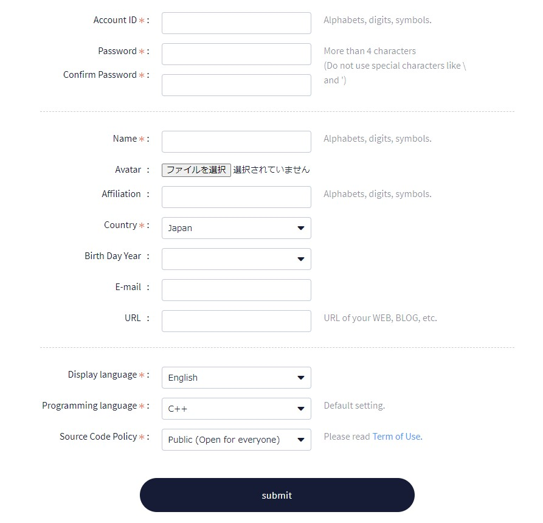
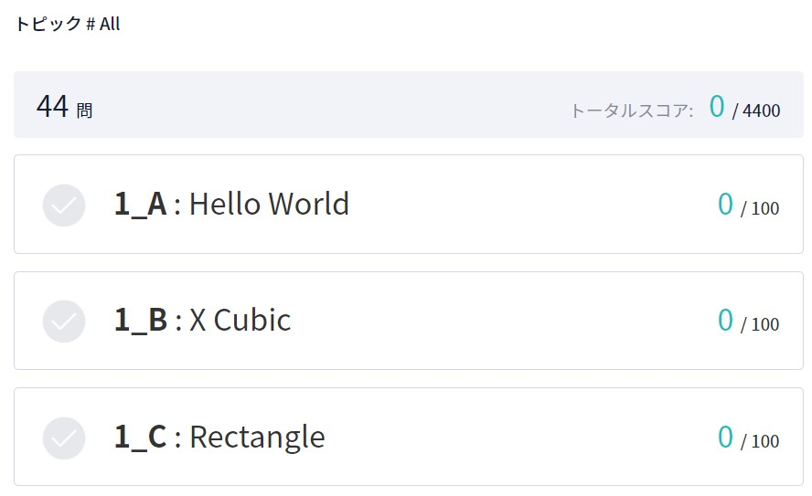
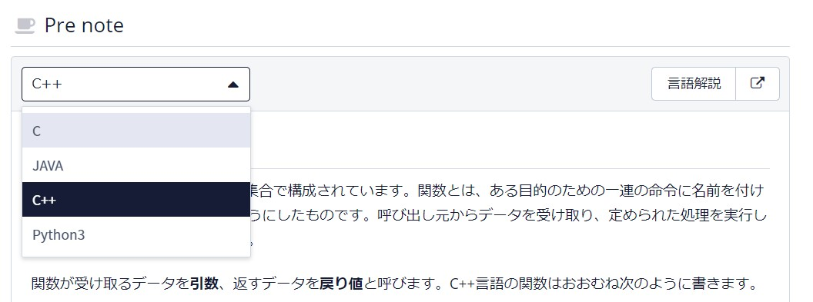
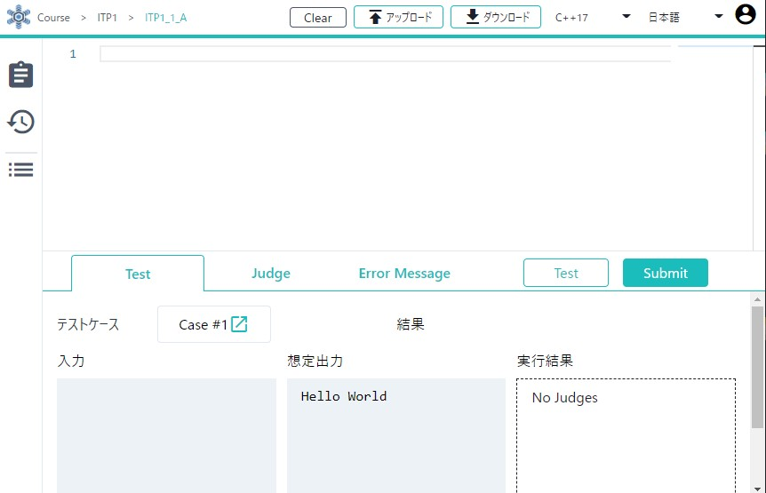
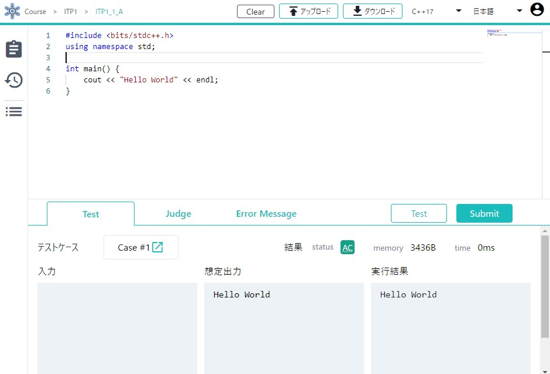
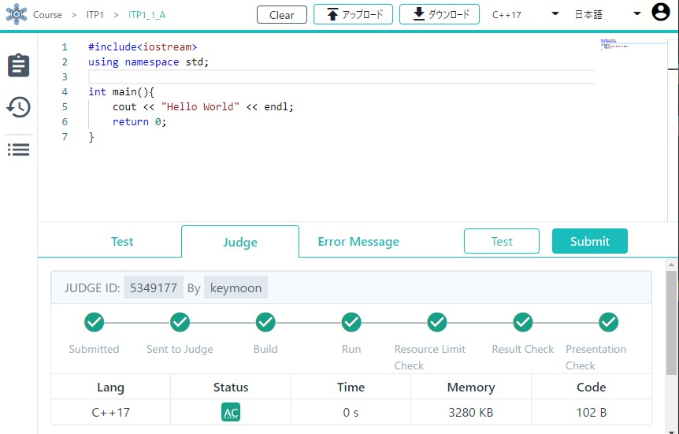
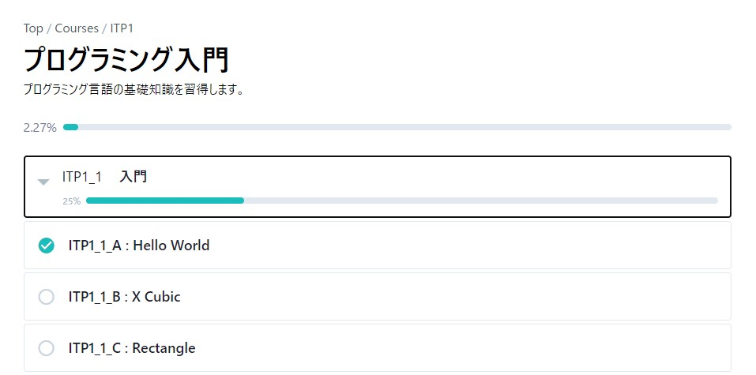

# 競技プログラミングの始め方

[競技プログラミングとは？](/beginner/about-compro)では、競技プログラミングのサイトとして AtCoder を紹介しました。しかし、この他にもこのようなオンラインジャッジと呼ばれるサイトはいくつかあります。
今回は、会津大学が運営するオンラインジャッジである [**Aizu Online Judge**](https://onlinejudge.u-aizu.ac.jp/home)(**AOJ**) を使って入門していきます。

## アカウントを作ろう

AOJ を使うためには、AOJ のアカウントが必要になります。
まず[アカウント作成の画面](https://onlinejudge.u-aizu.ac.jp/signup)にアクセスしてください。



Account ID は、Twitter 等でよく使っているものがあるならばそれを、ないならば自由に考えてください。もしも思いつかないならば、学籍番号で作ってしまっても良いです。いずれそのアカウントは授業で使うことになります。
Language は Japanese にしておくと、日本語がある問題は日本語で表示されるようになるので便利です。

## 問題を解いてみよう

### 問題を見る

今回は、AOJ のプログラミング学習コンテンツの [ITP1](https://onlinejudge.u-aizu.ac.jp/courses/lesson/2/ITP1) を使っていきます。これらが解けるようになれば、実際にコンテストに参加しても問題ないでしょう。

では、早速一番最初の問題を見てみましょう。先程の [ITP1](https://onlinejudge.u-aizu.ac.jp/courses/lesson/2/ITP1) を開き、一番上の [1_A: Hello World](https://onlinejudge.u-aizu.ac.jp/courses/lesson/2/ITP1/1/ITP1_1_A) をクリックしてください。



```
"Hello World" と標準出力にプリントするプログラムを作成してください。
```

とありますね。これが問題文で、これを満たすようなプログラムを書くことができればこの問題が解けたことになります。

今のままでは何を書けばよいか分からない方が多いと思います。そのために用意されているのが言語解説です。ITP の問題はそれぞれ言語説明と対応していて、これを読むことでどのようにプログラムを書くと良いかが分かります。



### プログラムを書いてみる

では、早速プログラムを書いてみましょう！
ここでは、AOJ が提供する AOJ 統合のプログラミング環境、[ICE](https://onlinejudge.u-aizu.ac.jp/beta/ice/) を使用します。これを使うと、Web ブラウザさえあればどこでも競技プログラミングができるようになります。

[ICE](https://onlinejudge.u-aizu.ac.jp/beta/ice/) を開くと、以下のような画面が見えるはずです。もしログインを求められた場合は、先程作成したアカウントでログインしてください。



ここで、左上に `Course > ITP1 > ITP1_1_A` と表示されていることを確認してください。これは、今から提出する問題が `ITP1_1_A`、つまり先程の `Hello World` であることを表しています。

次に、画面の中央にあるコーディング欄に上の問題をを解くコードを書いてみます。
書き上がったら、自分のプログラムが正しく動くかをサンプルを用いてテストしてみます。下部右側にある `Test` と書かれたボタンを押してみましょう。



画像では `AC` と出ています。これは、サンプルケースでは正解の出力を確認できたことになります。

もし `AC` と出なかった場合、あなたの書いたプログラムはサンプルの入力に対して正解の出力ができなかったということになります。それぞれのエラーについての詳細は[エラー集 - 付録](/beginner/appendix?id=エラー集)に説明があるので、それを読みながら `AC` が出るように修正してみましょう。

無事 `AC` が出たら、いよいよ本提出です。`Test` のボタンの横にある `Submit` ボタンを押してみましょう。



こちらも無事 `AC` と出ました！これによって、この問題が解けたことになります。おめでとうございます！

補足ですが、今回の問題では入力が存在しないため、サンプルテストが `AC` となれば本提出も `AC` となることが保証されていました。しかし、一般的な競技プログラミングの問題では本提出のテストケースよりもサンプルケースの方が少ない場合が多いです。そのため、サンプルで `AC` と出ても本提出では `AC` とならないこともあります。

### 他の問題も解いてみる

[ITP1](https://onlinejudge.u-aizu.ac.jp/courses/lesson/2/ITP1) には他の問題もあります。これらの問題をある程度解けば、実際にコンテストに参加しても問題ない程度のプログラミングの知識がついているはずです。

他の問題に挑戦する前に、一つだけ補足があります。他の問題に提出する際は、左上にある `Course > ITP1 > ITP1_1_A` の `ITP1_1_A` と書かれた場所をクリックしてから、自分が提出したい問題を選択してください。



これの後に、先程と同じように `Submit` を押すことで提出することができます。

それでは頑張ってください！他の問題を解いていく中で疑問点が生まれた場合、遠慮せずに質問をしてくださいね。
