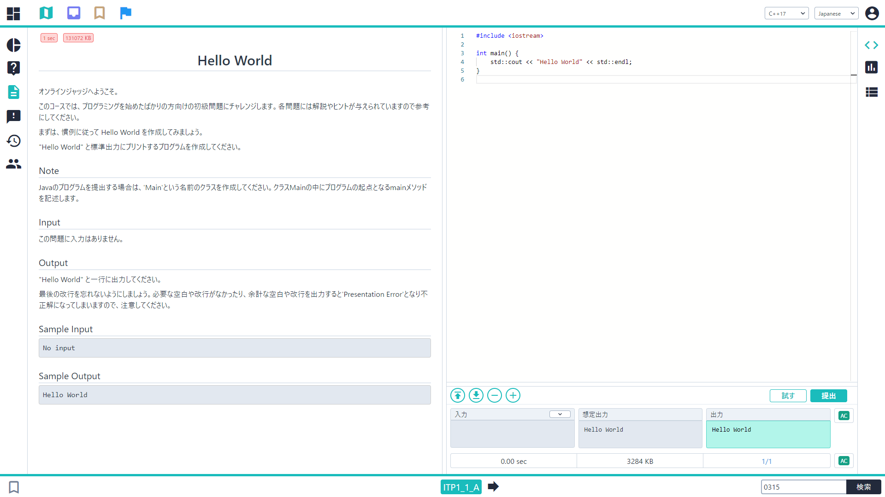
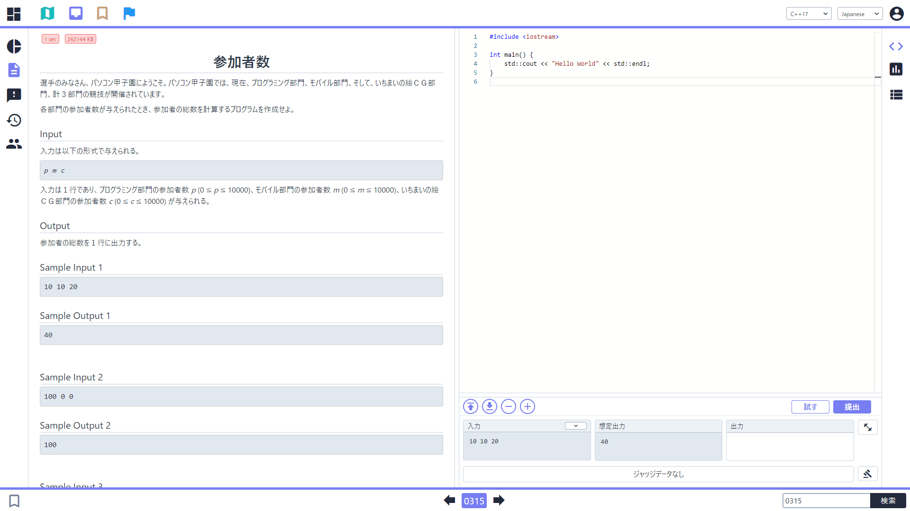
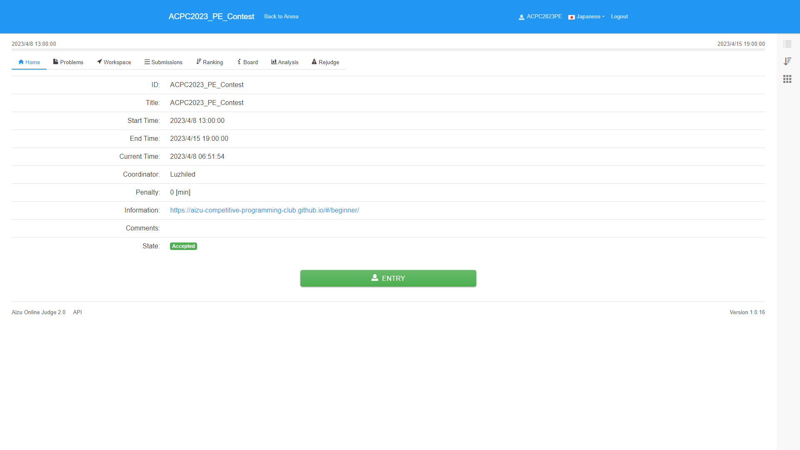

# プログラミングを体験してみよう

[競技プログラミングの始め方](/beginner/getting-started) では、AOJに登録したのち、[ICE](https://onlinejudge.u-aizu.ac.jp/beta/ice/) を用いて問題を1問解きました。

ここからは、会津大学が主催する高校生の大会である「パソコン甲子園」のプログラミング部門で過去に出題された実際の問題を通してプログラミングを体験していきます。

## 問題の開き方
AOJ に収録されている問題にはすべて ID が割り振られています。ICE ではその ID を指定することで問題を開くことができます。

試しに問題を開いてみましょう！ ICE の画面右下にある「問題IDを入力」に「0315」と入力して検索してみてください。




画面左側に「参加者数」という問題が表示されたら成功です！

ICE で問題を開くと、その問題のサンプルを画面右下の「試す」ボタンでテストしたり、「提出」ボタンで提出することができます。

## この章の進め方
プログラミングをはじめて学習するにあたってはいくつかの方法がありますが、今回は「写経」と呼ばれている方法を取ります。
写経とはもともと仏教の用語で、お経を書き写す修行の一つです。そこから派生して、「あらかじめ用意されているプログラムをそのまま全てタイピングして動かしていき、少しずつ感覚を養う」という導入が写経と呼ばれています。

この章では大きくわけて3つの領域について、それぞれ10問ずつの計30問を用意しました。それらのうち各5問を使って写経を行っていきます。

それぞれ、簡単な解説を書いていますが、後々理解を深めていくことを想定しているため、ここでその全てを理解する必要はありません。なんとなく「こんなことやっているんだな」という程度に留めておいて問題ないので、先に進むことを優先しましょう。

各問題については以下のように記載されています。

> A1-1 (0315) - 参加者数

(0315) のように、 () 内に記載されている4桁の整数が問題の ID となっています。

前述の通り、各領域に用意した10問のうち5問は解答を用意しており、それぞれ A1-1 から A1-5、B1-1 から B1-5、C1-1 から C1-5 となっています。まずはこれらの解答を見ながら、ICE の画面右側にあるコーディング環境にタイピングして回答してください。

コピペでも動作しますので、もしちゃんとタイピングを行ったつもりなのにテストが通らないなど、何か問題が生じた場合はコピペして写経しているプログラムが本当に正しいのかの確認を行うなどしてみても構いません。一方、コピペだけで問題を通す作業をするのは非推奨です。

また、問題に正解したあとに別の問題を開くと、それまでのコードが残ったままになっています。差分のみを更新する能力もまた必要なものではありますが、今回は一度全部消して、またはじめから書いていくことを推奨します。

コードのみが書かれたページも用意していますので、印刷などが行いたい場合に使ってください。画面左下の3本線を押すことでサイドバーを閉じることができます。

[プログラミングを体験してみよう - src](/beginner/src-programming-experience)

<!-- なんかバグっていて ICE で表示できなかったため非表示にしています
## Virtual Contest について
この章に出てくる計30問の問題をまとめてコンテスト形式にしたものが以下にあります。

[ACPC2023_PE_Contest](https://onlinejudge.u-aizu.ac.jp/services/room.html#ACPC2023_PE_Contest/info)



-->

## 四則演算

ここではまず、入力を受け取ったあとにコンピュータに四則演算をさせ、その結果を出力してみるところから始めていきます。

### A1-1 (0315) - 参加者数
まずは以下のコードを写経してみましょう。

```cpp
#include <iostream>

int main() {
  int p, m, c;
  std::cin >> p >> m >> c;

  std::cout << p + m + c << std::endl;
}
```

この問題は 

> `p` と `m` と `c` を受け取って、`p + m + c` を出力してください。

というものです。

```cpp
  int p, m, c;
```

という行では「整数を扱う `int` 型の変数 `p`, `m`, `c` を用意する」ということをしています。

変数については、「プログラム中で変えていく値に名前をつけたものこと」「プログラム中で変わりうる値に名前をつけたもののこと」だと思っておいてください。例えば、この問題では「プログラミング部門の参加者数」は**プログラムを実行して**入力を受け取ることで値がわかりますので、その値のことをプログラム中で `p` として扱っています。

変数には型というものが存在して、「その変数が何を扱えるのか」を規定します。今回は整数だけで解くことができるような問題を選定しているため、`int` 型(整数型)の変数のみで解くことができるようになっています。

<details><summary>変数名について</summary>

変数の名前はある一定の規則を守りさえすれば自由につけていただいても構いません。例えばこのプログラム中には変数 `p` が合計で3回出てきますが、これらをすべて `a` に変更しても実行結果は変わりません。変数名はある程度自由に決められることから、多くのケースでは「プログラマ(人間)にとってわかりやすいもの」をつけることになっています。

</details>

<details><summary>int型について</summary>

`int` 型は整数(英: **Int**eger)を扱う型です。

整数のすべてを扱えるわけではなく、おおよそ -20 億から +20 億までの整数のみを扱うことができます。

</details>

```cpp
  std::cin >> p >> m >> c;
```

という行では、変数 `p`, `m`, `c` に対して順番に入力する、ということを行っており、

```cpp
  std::cout << p + m + c << std::endl;
```

の行では、`p + m + c` を計算して出力して改行する、ということを行っています。`p + m + c` を計算するためには、プログラム中で `p + m + c` とそのまま書くだけで良いです。

入出力に対する詳細なことには触れませんが、いずれも、

```
std::cin >> 入力したい変数名 >> 入力したい変数名;

std::cout << 出力したいもの << std::endl;
```

のように書きます。

<details><summary>iostreamについて</summary>

入出力は本来難しいものであり、プログラマが1から実装しようとするとコンピュータに対する広範な知識が必要になる場合があります。

一方で、入出力などの頻出なものに対しては「あらかじめ用意されているプログラム群」が存在していることが多く、このようなもののことを「ライブラリ」などと呼びます。

1行目の
```cpp
#include <iostream>
```
は、入出力を扱う `std::cin`, `std::cout` を使えるようにするため、`<iostream>` という標準ライブラリをこの場所に展開する、ということを行っています。

</details>

### A1-2 (0479) - ２０周年
まずは以下のコードを写経してみましょう。

```cpp
#include <iostream>

int main() {
  int Y;
  std::cin >> Y;

  std::cout << Y - 2002 << std::endl;
}
```

詳細な考察については省略しますが、この問題は 

> `Y` を受け取って、`Y - 2002` を出力してください。

というものです。なぜそうなるのかについては考察してみてください。

引き算も足し算と同様に、`a - b` と書くと `a` から `b` を引いた値を計算することができます。

また、-20億から20億程度の範囲に収まる定数の整数であれば、このコードのようにプログラム中に直接書くこともできます。

### A1-3 (0335) - ワード
まずは以下のコードを写経してみましょう。

```cpp
#include <iostream>

int main() {
  int W;
  std::cin >> W;

  std::cout << 32 * W << std::endl;
}
```

この問題は 

> `W` を受け取って、`32 * W` を出力してください。

というものです。

掛け算も同様に、`a * b` と書くと `a` と `b` の積を計算することができます。

`x` (英小文字のエックス) などのほうが普段書いている記号に近いかもしれませんが、プログラム中では `*` (半角アスタリスク) であることに注意してください。

### A1-4 (0453) - マウス の移動距離
まずは以下のコードを写経してみましょう。

```cpp
#include <iostream>

int main() {
    int d;
    std::cin >> d;

    std::cout << d / 4 << std::endl;
}
```

この問題は 

> `d` を受け取って、`d` を4で割った結果を出力してください。

というものです。

`a / b` と書くと `a` を `b` で割った値から**小数点を切り捨てた値**を計算することができます。これは整数型の値と整数型の値の計算結果を整数型の範囲内で計算するためにこうなっています。

実数が必要な場合は `int` 型ではなく、適切な他の型を用いる必要がありますが、今回はそのような型が必要なことはありませんので、また後ほど必要になったら学習してみてください。

この問題では `d` が4の倍数であることが保証されているため、計算結果は整数になることが保証されています。

### A1-5 (0357) - お年玉
まずは以下のコードを写経してみましょう。

```cpp
#include <iostream>

int main() {
  int a, b;
  std::cin >> a >> b;

  std::cout << (a + b) / 2 << std::endl;
}
```

この問題は 

> `a`, `b` を受け取って、`(a + b)` を2で割った結果を出力してください。

というものです。

プログラム中での四則演算は通常の四則演算の計算順序と同様の順で計算されますので、乗算や除算より先に加算や減算を行いたい場合は `()` で括ります。

注意点として、数学の文脈では優先順位を変更するためのカッコが入れ子になっているときなどに、() の代わりとして {} を用いたり [] を用いたりすることがありますが、プログラム中ではすべて `()` である必要があります。

### A2-1 (0404) - 柴犬の数
ここまでの知識を用いて解ける演習問題の1問目です。

解けない場合は一度スキップしても構いません。

### A2-2 (0428) - 緯度経度
ここまでの知識を用いて解ける演習問題の2問目です。

解けない場合は一度スキップしても構いません。

### A2-3 (0380) - 摂氏華氏
ここまでの知識を用いて解ける演習問題の3問目です。

解けない場合は一度スキップしても構いません。

### A2-4 (0466) - 切り上げ除算
ここまでの知識を用いて解ける演習問題の4問目です。

解けない場合は一度スキップしても構いません。

### A2-5 (0392) - 旅行先のパーティ
ここまでの知識を用いて解ける演習問題の5問目です。

解けない場合は一度スキップしても構いません。


## 制御構文 - if 文

「この場合はこう、そうでない場合でこの場合はこう、いずれでもない場合はこう」といったように、そのときの条件によってある動作を行うかどうか分岐するようなもののことを**条件分岐**と言います。

ここでは、条件分岐を行うために用いる `if` 文を使ってみるところから始めていきます。

### B1-1 (4000) - 卓球
まずは以下のコードを写経してみましょう。

```cpp
#include <iostream>

int main() {
  int p, q;
  std::cin >> p >> q;

  if ((p + q) % 6 == 0) {
    std::cout << 1 << std::endl;
  } else {
    std::cout << 0 << std::endl;
  }
}
```

この問題は 

> `p` と `q` を受け取って、`p + q` が 6 の倍数なら `1` を、そうでないなら `0` を出力してください。

というものです。

条件分岐で用いる `if` 文の構文は次のようになっています

```cpp
if (条件1) {

  条件1に合致した場合に実行されるプログラム

} else {

  条件1に合致しない場合に実行されるプログラム

}
```

新しい演算子として、`%` と `==` が出てきたので、それらについて説明します。

`%` は「`a` を `b` で割った**あまり**」を計算する演算子です。この演算は**剰余**(じょうよ)演算とも言います。演算の優先順位は除算と同じです。

`==` は 「`a` と `b` が**一致**するかどうか」を計算する演算子です。

<details><summary> == について </summary>

数学では単に =(イコール) と書かれますが、数学での = には「一致させる」「一致する」の2つの意味が主にあり、プログラム中ではその曖昧さが問題になるためこのようになっています。

</details>

`p + q` が 6 の倍数のとき、かつそのときに限り `p + q` を 6 で割ったあまりは 0 になります。よって、上のプログラムを日本語で記述すると

```cpp
if ( p + q が6の倍数である ) {

  p + q が 6 の倍数なので 1 を出力

} else {

  p + q が 6 の倍数なので 0 を出力

}
```

となっています。

このあたりからはプログラミング特有の考え方が増えてきますので、一度で理解できなかった場合でもとりあえず先に進んでみてからまた戻ってきてみてください。

### B1-2 (0405) - アスキー文字
まずは以下のコードを写経してみましょう。

```cpp
#include <iostream>

int main() {
  int N;
  std::cin >> N;

  if (65 <= N and N <= 90) {
    std::cout << 1 << std::endl;
  } else if (97 <= N and N <= 122) {
    std::cout << 2 << std::endl;
  } else {
    std::cout << 0 << std::endl;
  }
}
```

この問題は 

> `N` を受け取ります。 `N` が 65 以上 90 以下なら `1` を、97 以上 122 以下なら `2` を、そのいずれでもないなら `0` を出力してください。

というものです。

今回は、先程から一つ条件の分岐が増えて3つになりました。

条件が3つ以上に分岐する場合は次のように書くことになります。

```cpp
if (条件1) {

  条件1に合致した場合に実行されるプログラム

} else if (条件2) {

  条件1に合致しない、
  かつ条件2に合致する場合に実行されるプログラム

} else if (条件3) {

  条件1, 2 に合致しない、
  かつ条件3に合致する場合に実行されるプログラム

} else if (条件4) {
  
  ... (省略)

} else {

  条件 1, 2, ... に合致しない場合に実行されるプログラム

}
```

<details> <summary> else if 文について </summary>

ここでは `else if` という新しい構文が増えたように思えるかもしれませんが、次のように考えると `if` 文と `else` 文だけで構成されていると思うこともできます。

```cpp
if (条件1) {

  ...

} else { // <- 条件1の else 文
  if (条件2) {

    ...

  } else { // <- 条件2の else 文

    ...

  }
}
```

条件によっては `if` 文や `else` 文ののちに来る `{}` は省略することが可能です。
</details>

ここでも1つ、新しい演算子として `<=` が出てきましたので、関連する3つも含めて説明します。

`<=` は「`a` と `b` を比較して、`a` が `b` 以下であるかどうか」を計算する演算子です。

この他に、`>=` 演算子や `<` 演算子、 `>` 演算子があります。それぞれの演算子は、`<=` 演算子と同様に、「以上」「より小さい」「より大きい」かどうかを計算します。

`=>` ではなく `>=` であることに注意してください。

### B1-3 (0358) - 買い物
まずは以下のコードを写経してみましょう。

```cpp
#include <iostream>

int main() {
  int m, f, b;
  std::cin >> m >> f >> b;

  if (b <= m) {
    std::cout << 0 << std::endl;
  }

  if (b > m and b <= m + f) {
    std::cout << b - m << std::endl;
  }

  if (b > m + f) {
    std::cout << "NA" << std::endl;
  }
}
```

この問題は 

> `m`, `f`, `b` を受け取ります。 `b <= m` なら `0` を、そうでない場合で `b <= m + f` なら `b - m` を、そのいずれでもない場合は `NA` を出力してください。

というものです。

`if` 文に対する `else` 文は省略することも可能ですので、すべての条件を書いた `if` 文3つを書くことでも実装することができます。

「A かつ B のとき」という条件を書く必要があります。このような演算は論理積と呼ばれ、`A and B`、または `A && B` と書きます。もともとは `A && B` という記法のみでしたが、これは `A & B` と書いてしまうと意味が変わるにも関わらず問題なく実行できてしまうなどの問題があるため、`A and B` という記法を推奨しています。

文字列を出力するためには、[前の頁](/beginner/getting-started?id=プログラムを書いてみる)でやった Hello World でやったように、`"` (ダブルクオーテーション)2つで囲って

```cpp
std::cout << "出力したい文字列" << std::endl;
```

とします。

### B1-4 (0429) - 商店街へのお出かけ
まずは以下のコードを写経してみましょう。

```cpp
#include <iostream>

int main() {
  int w, m, s;
  std::cin >> w >> m >> s;

  if (m < s and m < (w - s)) {
    std::cout << 0 << std::endl;
  } else if (m >= s and m < (w - s)) {
    std::cout << 1 << std::endl;
  } else if (m < s and m >= (w - s)) {
    std::cout << 2 << std::endl;
  } else {
    std::cout << 3 << std::endl;
  }
}
```

この問題は 

> `w`, `m`, `s` を受け取ります。ここで、
> - A: `m < s` が成り立つ
> - B: `m < (w - s)` が成り立つ
>
> としたとき、A かつ B なら `0` を、A でないかつ B なら `1` を、A かつ B でないなら `2` を、A でないかつ B でないなら `3` を出力してください。

というものです。

条件が4つになりましたが、これまでと同様に書くことができます。

### B1-5 (0257) - 乗車券
まずは以下のコードを写経してみましょう。

```cpp
#include <iostream>

int main() {
  int b1, b2, b3;
  std::cin >> b1 >> b2 >> b3;

  if ((b1 == 1 and b2 == 1 and b3 == 0) or (b1 == 0 and b2 == 0 and b3 == 1)) {
    std::cout << "Open" << std::endl;
  } else {
    std::cout << "Close" << std::endl;
  }
}
```

この問題は 

> `b1`, `b2`, `b3` を受け取ります。このとき、
> 
> - `b1`, `b2` が `1` で、かつ `b3` が `0` である
> - `b1`, `b2` が `0` で、かつ `b3` が `1` である
>
> のいずれかの場合は `Open` を、そうでない場合は `Close` を出力してください。

というものです。

ここでは「A または B のとき」という条件を書く必要があります。このような演算は論理和と呼ばれ、`A or B`、または `A || B` と書きます。`and` のときと同様に、もともとは `A || B` という記法のみでしたが、これは `A | B` と書いてしまうと意味が変わるにも関わらず問題なく実行できてしまうなどの問題があるため、`A or B` という記法を推奨しています。

ここの `if` 文の条件は少し長くなってしまっていますが、「(`b1` が `1` かつ `b2` が `1` かつ `b3` が `0`)、または(`b1` が `0` かつ `b2` が `0` かつ `b3` が `1`)」という条件をそのまま書いています。


### B2-1 (0381) - 赤とんぼ
ここまでの知識を用いて解ける演習問題の1問目です。

解けない場合は一度スキップしても構いません。

### B2-2 (0454) - ミニ 絵合わせゲーム
ここまでの知識を用いて解ける演習問題の2問目です。

解けない場合は一度スキップしても構いません。

### B2-3 (0345) - 長方形
ここまでの知識を用いて解ける演習問題の3問目です。

解けない場合は一度スキップしても構いません。

### B2-4 (0480) - 体温測定
ここまでの知識を用いて解ける演習問題の4問目です。

解けない場合は一度スキップしても構いません。

### B2-5 (0359) - ９月Ｘ日
ここまでの知識を用いて解ける演習問題の5問目です。

解けない場合は一度スキップしても構いません。

## 制御構文 - ループ

コンピュータは「何度も同じような計算を行える」「簡単な計算を非常に高速に行う」ことが大きな利点でもあります。

ここでは、そのような性質を活かすために有用な構文である `while` 文と `for` 文を使ってみましょう。

この章は特に話が難しいかと思いますので、詳細な説明は行われておりません。
また後ほど言語についての詳細な学習を行うかと思いますので、「こんなものがあるんだな」という体験程度に留め、しっかりした理解はまた後ほど行いましょう。

### C1-1 (0406) - ２の累乗
まずは以下のコードを写経してみましょう。

```cpp
#include <iostream>

int main() {
  int N;
  std::cin >> N;

  int answer = 1;
  while (2 * answer <= N) {
    answer = 2 * answer;
  }

  std::cout << answer << std::endl;
}
```

この問題は 

> `N` を受け取って、`N` 以下で最も大きい 2 の冪を出力してください。

というものです。

まずは `while` 文についてです。`while` 文は次のような構文になっています。

```cpp
while (条件) {

  条件が満たされているとき実行されるプログラム

}
```

`while` 文に書かれている条件が満たされている間は `{ }` 内に書かれている内容が繰り返しずっと実行され、条件が満たされなくなったら `while` 文自体は終了し、 `{ }` 以降に書かれている内容が実行されていくことになります。

他にも1つ、`answer = 1` という新しい記法が出てきましたので、その説明もいていきます。

```cpp
  int answer = 1;
```

ここではこれまでと同様に `int` 型の変数 `answer` を宣言していますが、これまでとは異なり、この変数には入力が行われるわけではありません。

`answer = 1` とすると、変数 `answer` の(実際に表現している)値を `1` とします。この操作のことを**代入**といい、`=` のことを代入演算子と呼びます。

このプログラムでは、`answer` の値を `1` にしてから、「2倍しても `N` 以下」の間は `answer` を2倍する、ということをしています。

`while` 文の中に `answer = 2 * answer` とありますが、これは 「`answer` を 2 倍した値」を `answer` に代入する、ということをしています。

### C1-2 (0455) - ダイヤル錠
まずは以下のコードを写経してみましょう。

```cpp
#include <iostream>

int main() {
  int N;
  std::cin >> N;

  int prev_a = 0;
  int answer = 0;

  for (int i = 0; i < N; i++) {
    int a;
    std::cin >> a;

    int ccw, cw;
    if (prev_a <= a) {
      ccw = a - prev_a;
      cw = (10 + prev_a) - a;
    } else {
      cw = prev_a - a;
      ccw = (10 + a) - prev_a;
    }

    if (ccw < cw) {
      answer += ccw;
    } else {
      answer += cw;
    }

    prev_a = a;
  }

  std::cout << answer << std::endl;
}
```

この問題は、問題の内容が多少複雑になっているため、もとの問題の内容を読んでみてください。

まずは `for` 文についてです。`for` 文は次のような構文になっています。

```cpp
for (最初に1度だけ実行される文; 条件; ループの最後に行われる文) {

  条件が満たされているとき実行されるプログラム

}
```

`for` 文も `while` 文と同じく、繰り返しを行うための構文です。

`while` 文と同様に、`for` 文に書かれている条件が満たされている間は `{ }` 内に書かれている内容が繰り返し実行され、条件が満たされなくなったら `for` 文が終了し、`{ }` 以降にかかれている内容が実行されていくことになります。

`while` 文との違いは、最初に1度だけ実行される文を持つことと、各繰り返しの最後に実行される文を持つことです。

```cpp
  for (int i = 0; i < N; i++) {
```

実際のコードに出てくる `for` 文はこのようになっています。このうち、`int i = 0` という文は `for` 文の最初に1度だけ実行され、`i++` という文は`for` 文で繰り返し実行が行われている間、各ループの最後に実行されます。

ここで、新しい記法である `i++` というものが出てきましたが、これは「変数 `i` の値を1増やす」演算になっています。これはインクリメントと呼ばれます。

他にも、`answer += cw` のような書き方が出てきています。この `+=` は「複合代入演算子」というもので、`answer = answer + cw` と同じ動作を、より簡潔に書くことができます。

### C1-3 (0431) - カラフル円盤通し
まずは以下のコードを写経してみましょう。

```cpp
#include <iostream>
#include <vector>

int main() {
  int N;
  std::cin >> N;

  std::vector< int > r(N);
  for (int i = 0; i < N; i++) {
    std::cin >> r[i];
  }

  int max_r = 0;
  int answer = 0;
  for (int i = N - 1; i >= 0; i--) {
    if (max_r < r[i]) {
      answer++;
      max_r = r[i];
    }
  }

  std::cout << answer << std::endl;
}
```

この問題は、

> `N` と、長さ `N` の数列 `r` が与えられます。
> 
> この数列を逆順に見ていったとき、最大値は何回更新されますか？

という問題です。

これまでは定数個の変数しか扱ってきませんでしたが、 `N` 個の変数を同時に扱う方法として、`std::vector` というものがあります。

<details> <summary> 配列について </summary>

C 言語には配列という機能が存在して、たとえば 10000 個の `int` 型の変数が必要になったときは、`int a[10000]` と宣言することで `a[0]` から `a[9999]` までの10000個の変数が使えます。

C++ でも C 言語の配列と同じものが使えますが、より高機能なものとして `std::vector` があります。特に配列でなければならない状況というのはそう多くはありませんので、今回は `std::vector` だけを使います。
</details>

```cpp
  std::vector< int > r(N);
```

と宣言することによって、`N` 個の `int` 型の変数を作成することができています。各変数には、**0からはじめて** `r[0]`, `r[1]`, ..., `r[N-1]` とすることで扱うことができます。`1` から始まっていないこと、`N` で終わっていないことに注意してください。

### C1-4 (0407) - 集会所
まずは以下のコードを写経してみましょう。

```cpp
#include <iostream>
#include <vector>

int main() {
  int N;
  std::cin >> N;

  std::vector< int > x(N);
  for (int i = 0; i < N; i++) {
    std::cin >> x[i];
  }

  int min_x = 2000, max_x = 0;
  for (int i = 0; i < N; i++) {
    if (min_x > x[i]) {
      min_x = x[i];
    }
    if (max_x < x[i]) {
      max_x = x[i];
    }
  }

  std::cout << (max_x - min_x + 1) / 2 << std::endl;
}
```

この問題は、

> `N` と、長さ `N` の数列 `x` が与えられます。
> 
> ある整数を決めたとき、その整数から各 x の値との絶対値の最小値は何になりますか？

という問題です。

この問題は、数列の最小値と最大値を計算し、その差を切り上げたものが答えになります。

プログラム自体はこれまでの知識で解くことができます。

### C1-5 (0318) - 極秘調査
まずは以下のコードを写経してみましょう。

```cpp
#include <iostream>
#include <vector>

int main() {
  int N;
  std::cin >> N;

  int X;
  std::cin >> X;

  std::vector< int > a(X);
  for (int i = 0; i < X; i++) {
    std::cin >> a[i];
  }

  int Y;
  std::cin >> Y;

  std::vector< int > b(Y);
  for (int i = 0; i < Y; i++) {
    std::cin >> b[i];
  }

  int Z;
  std::cin >> Z;

  std::vector< int > c(Z);
  for (int i = 0; i < Z; i++) {
    std::cin >> c[i];
  }

  int answer = 0;
  for (int i = 0; i < Z; i++) {
    int is_belongs_a = 0;
    for (int j = 0; j < X; j++) {
      if (a[j] == c[i]) {
        is_belongs_a = 1;
      }
    }

    int is_belongs_b = 0;
    for (int j = 0; j < Y; j++) {
      if (b[j] == c[i]) {
        is_belongs_b = 1;
      }
    }

    if (is_belongs_a == 0 or is_belongs_b == 1) {
      answer++;
    }
  }

  std::cout << answer << std::endl;
}
```

この問題は、

> 数列 `a`, `b`, `c` が与えられます。このうち、以下を満たすものはいくつあるでしょうか。
> 
> - c に含まれており、かつ以下の2つのいずれかを満たす
>   - a に含まれていない
>   - b に含まれている

という問題です。

通常の変数と同様に `std::vector< int >` も複数宣言することができます。コード中では離れていてわかりにくいかもしれませんが、ここでは 

```cpp
  std::vector< int > a(X);

  ...

  std::vector< int > b(Y);

  ...

  std::vector< int > c(Z);
```

のように、合計で3つの `std::vector< int >` が宣言されています。

非常に長くなっていますが、やっていること自体はこれまでに出てきたものの組み合わせです。

### C2-1 (0430) - あいさつまわり
ここまでの知識を用いて解ける演習問題の1問目です。

解けない場合は一度スキップしても構いません。

### C2-2 (0382) - ケーキパーティー
ここまでの知識を用いて解ける演習問題の2問目です。

解けない場合は一度スキップしても構いません。

### C2-3 (0482) - グループ
ここまでの知識を用いて解ける演習問題の3問目です。

解けない場合は一度スキップしても構いません。

### C2-4 (0383) - 熱中症対策
ここまでの知識を用いて解ける演習問題の4問目です。

解けない場合は一度スキップしても構いません。

### C2-5 (0360) - 予約システム
ここまでの知識を用いて解ける演習問題の5問目です。

解けない場合は一度スキップしても構いません。

